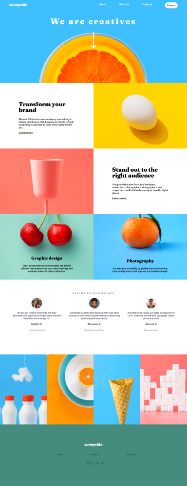
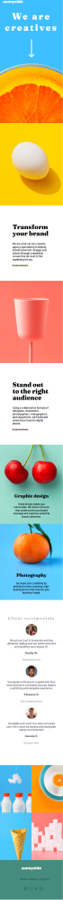

# Sunny-side Agency
***
Le projet "Sunny-side Agency" a pour objectif de créer un design web à la fois esthétique, moderne et responssive.

## Table des matières
1. [Utilisation](#utilisation)
2. [Technologies](#technologies)
3. [Captures d'écran](#captures-décran)
4. [Améliorations futures](#ameliorations-futures)

### Utilisation
***
Pour utiliser l'application, suivez ces étapes :

1. Allez sur la page [Sunny side agency](https://tess-mltx.github.io/sunnyside-agency/)
2. Modifier la taille de la fenêtre pour observer l'aspect responssive.

### Captures d'écran
***

## Technologies
***
Liste des technologies utilisées dans le projet :
* [SASS](https://sass-lang.com/)

## Améliorations futures
***
* Vérification / correction des margin et padding < 350px.
* Correction des effets hover.